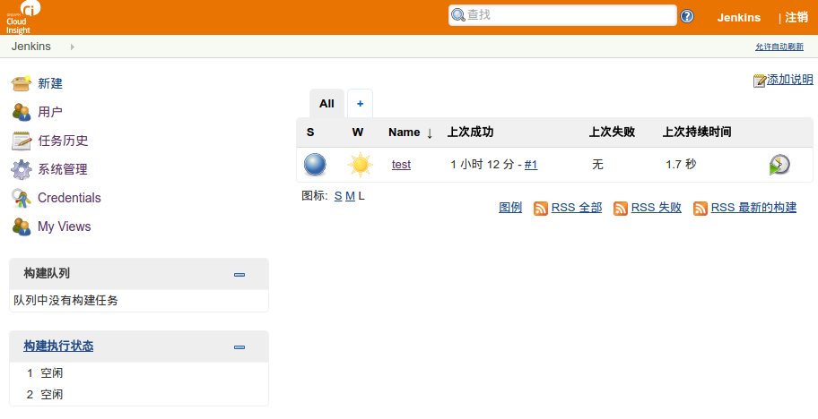
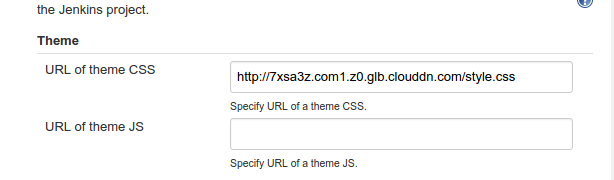

# jenkins-theme

> Cloudinsight 使用的简单的 Jenkins 自定义主题



## 修改内容

- 替换 Jenkins 的 Logo
- 修改默认字体

## 安装

- Jenkins 需要安装这个插件

```
http://wiki.jenkins-ci.org/display/JENKINS/Simple+Theme+Plugin
```

- 设置自定义的 CSS 地址



```
http://7xsa3z.com1.z0.glb.clouddn.com/style.css
```